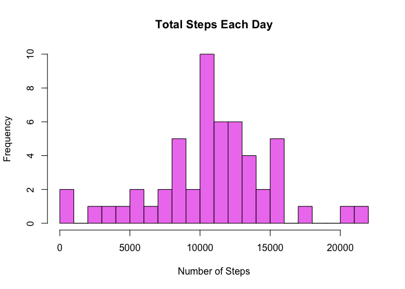
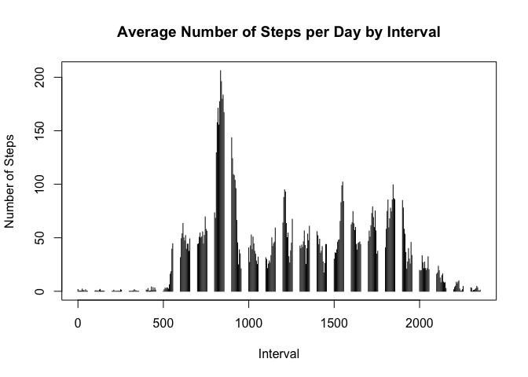
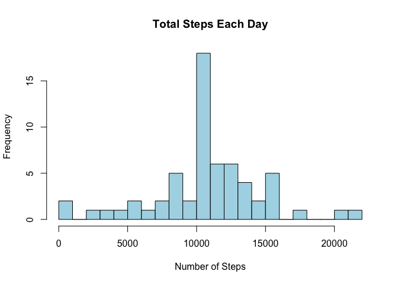
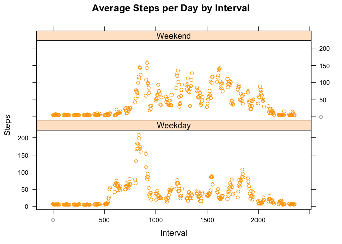

## Loading and preprocessing the data


```r
library(dplyr)
```

```
## Warning: package 'dplyr' was built under R version 4.0.2
```

```
## 
## Attaching package: 'dplyr'
```

```
## The following objects are masked from 'package:stats':
## 
##     filter, lag
```

```
## The following objects are masked from 'package:base':
## 
##     intersect, setdiff, setequal, union
```

```r
library(ggplot2)
```

```
## Warning: package 'ggplot2' was built under R version 4.0.2
```

```r
library(ggpubr)
```

```
## Warning: package 'ggpubr' was built under R version 4.0.2
```

```r
library(stats)
library(lattice)
library(Hmisc)
```

```
## Warning: package 'Hmisc' was built under R version 4.0.2
```

```
## Loading required package: survival
```

```
## Loading required package: Formula
```

```
## 
## Attaching package: 'Hmisc'
```

```
## The following objects are masked from 'package:dplyr':
## 
##     src, summarize
```

```
## The following objects are masked from 'package:base':
## 
##     format.pval, units
```


It is now possible to collect a large amount of data about personal movement using activity monitoring devices such as a Fitbit, Nike Fuelband, or Jawbone Up. These type of devices are part of the "quantified self" movement -- a group of enthusiasts who take measurements about themselves regularly to improve their health, to find patterns in their behavior, or because they are tech geeks. But these data remain under-utilized both because the raw data are hard to obtain and there is a lack of statistical methods and software for processing and interpreting the data.

This assignment makes use of data from a personal activity monitoring device. This device collects data at 5 minute intervals through out the day. The data consists of two months of data from an anonymous individual collected during the months of October and November, 2012 and include the number of steps taken in 5 minute intervals each day.


```r
activity <- read.csv("activity.csv")
summary(activity)
```

```
##      steps            date              interval     
##  Min.   :  0.00   Length:17568       Min.   :   0.0  
##  1st Qu.:  0.00   Class :character   1st Qu.: 588.8  
##  Median :  0.00   Mode  :character   Median :1177.5  
##  Mean   : 37.38                      Mean   :1177.5  
##  3rd Qu.: 12.00                      3rd Qu.:1766.2  
##  Max.   :806.00                      Max.   :2355.0  
##  NA's   :2304
```

This file has 17568 observations, 2304 of that are NA, and three variables: `steps`, `date` and `interval`.


## What is mean total number of steps taken per day?

We are going to plot a histogram of the number of steps per day.


```r
steps_day <- aggregate(steps ~ date, activity, sum)
hist(steps_day$steps, main = paste("Total Steps Each Day"), col="violet",xlab="Number of Steps", breaks = 30)
```

<!-- -->


Now we are going to calculate the mean total number of steps taken per day:


```r
mean_steps <- mean(steps_day$steps)
mean_steps
```

```
## [1] 10766.19
```

According to out data, this person took 10766,19 steps per day, in average.
The mean of this distribution:


```r
median_step <- median(steps_day$steps)
median_step
```

```
## [1] 10765
```

We can see our mean and median are very close, suggesting that we have a normal distribution.

## What is the average daily activity pattern?

We are going to analyze the average daily activity pattern calculating the average of steps for each interval of days.


```r
steps_interval <- aggregate(steps ~ interval, activity, FUN = mean)
plot(steps_interval$interval,steps_interval$steps, type="h", xlab="Interval", ylab="Number of Steps",main="Average Number of Steps per Day by Interval")
```

<!-- -->


```r
max_interval <- steps_interval[which.max(steps_interval$steps),]$interval
max_interval
```

```
## [1] 835
```

```r
max_steps <- max(steps_interval$steps)
max_steps
```

```
## [1] 206.1698
```

The 5-minute interval with more steps is 835 with 206.1698 steps.


## Imputing missing values

Now we are going to determine how many cases has NA:


```r
sum(!complete.cases(activity))
```

```
## [1] 2304
```

We can see that 2304 data are missing in this dataset. We are going to replace the missing data with the mean of steps, unsing the function `impute`. Imputing missing values:


```r
new_act <- activity

new_act$steps <- impute(activity$steps, fun=mean)

summary(new_act)
```

```
## 
##  2304 values imputed to 37.3826
```

```
##      steps            date              interval     
##  Min.   :  0.00   Length:17568       Min.   :   0.0  
##  1st Qu.:  0.00   Class :character   1st Qu.: 588.8  
##  Median :  0.00   Mode  :character   Median :1177.5  
##  Mean   : 37.38                      Mean   :1177.5  
##  3rd Qu.: 37.38                      3rd Qu.:1766.2  
##  Max.   :806.00                      Max.   :2355.0
```

Plotting a new histogram of the number of steps per day:


```r
new_steps_day <- aggregate(steps ~ date, new_act, sum)
hist(new_steps_day$steps, main = paste("Total Steps Each Day"), col="light blue",xlab="Number of Steps", breaks = 30)
```

<!-- -->
Calculating the mean and the median of the fill dataset:


```r
new_mean_steps <- mean(new_steps_day$steps)
new_mean_steps
```

```
## [1] 10766.19
```

```r
new_median_steps <- median(new_steps_day$steps)
new_median_steps
```

```
## [1] 10766.19
```

The mean and median are not so different from the values found with the incomplete dataset.

## Are there differences in activity patterns between weekdays and weekends?

Now we are going to see if there is difference in the activity pattern between weekdays and weekends. First we are going to create a new variable called `weekdays` using the column `date` from our `new_act` dataset:


```r
new_act <- new_act %>% mutate(weekdays = weekdays(as.Date(date))) #changing the date for thee days of week
new_act <- new_act %>% mutate(is_week = ifelse(weekdays %in% c("Saturday", "Sunday"),"Weekend","Weekday")) #creating two level variable
head(new_act,3)
```

```
##     steps       date interval weekdays is_week
## 1 37.3826 2012-10-01        0   Monday Weekday
## 2 37.3826 2012-10-01        5   Monday Weekday
## 3 37.3826 2012-10-01       10   Monday Weekday
```

Plotting the data:


```r
new_steps_interval <- aggregate(steps ~ interval + is_week, new_act, FUN = mean)

xyplot(new_steps_interval$steps ~ new_steps_interval$interval|new_steps_interval$is_week, main="Average Steps per Day by Interval",xlab="Interval", ylab="Steps",layout=c(1,2), type="p", col = "orange")
```

<!-- -->

Wee can see the activity for weekends are lower than for weekdays.
